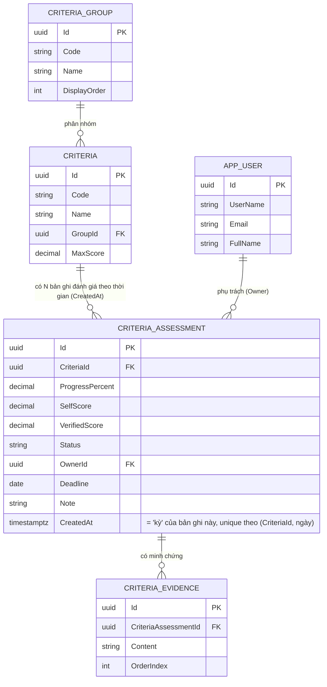

# ERD — DTI Weekly (theo dõi tiến độ chuyển đổi số hàng tuần)

> **Trạng thái: DỰ KIẾN.** Đây là ERD tổng hợp cho lần scaffold + migration
> đầu tiên của `src/BE`, không phải schema đã chốt hay migration đã chạy.
> Đối chiếu lại với người dùng trước khi `dotnet ef migrations add` lần đầu
> (xem `src/BE/.claude/rules/entity-domain.md` mục "Khi thêm entity mới" và
> `src/BE/CLAUDE.md` mục Maintenance Rules #2).
>
> File DBML tương ứng: [`PlatformManager.dbml`](./PlatformManager.dbml)
> (import vào [dbdiagram.io](https://dbdiagram.io) để xem sơ đồ tương tác).

## Quyết định đã CHỐT (người dùng xác nhận)

Bản cập nhật này chốt 3 điểm trước đó nằm ở mục "Câu hỏi còn mở":

1. **`Owner`/`Deadline`** → giữ theo từng kỳ, trên `CriteriaAssessment`
   (không đổi cấu trúc, đúng thiết kế ban đầu).
2. **`Status`** → nhập tay, lưu DB trên `CriteriaAssessment` (đúng thiết kế
   ban đầu) — nhưng **đây là khái niệm khác** với badge (done/working/
   stalled) mà `dashboard.html` tự tính từ delta điểm số giữa 2 kỳ. Xem chi
   tiết ở mục 4 bên dưới, **đừng nhầm lẫn khi implement/thiết kế UI**.
3. **Auth** → **ASP.NET Core Identity**. Thêm entity `AppUser` (đại diện
   cho `IdentityUser<Guid>`), đổi `CriteriaAssessment.Owner` (text tự do)
   thành `CriteriaAssessment.OwnerId` (FK → `AppUser.Id`). Xem entity 0 và
   entity 4 bên dưới. Cũng đã cập nhật `src/BE/CLAUDE.md` và
   `src/BE/.claude/rules/api-controller.md` § Auth/Permission.

### 4. (2026-08-12) Bỏ `AssessmentPeriod` — "kỳ" suy ra từ `CreatedAt`, không còn entity/hành động tạo kỳ tường minh

**Quyết định người dùng (nguyên văn)**: *"Ở danh mục DTI bỏ tạo kỳ mới nhất,
vì kỳ được xác định theo ngày tạo createdDate chứ không có tách kỳ riêng."*

Đây là thay đổi kiến trúc dữ liệu lớn nhất kể từ ERD gốc — **loại bỏ hoàn
toàn** bảng `AssessmentPeriod` và hành động "Tạo kỳ mới từ kỳ gần nhất". Lý
do và thiết kế thay thế chi tiết: xem mục mới **"Kỳ (tuần/tháng/năm) — khái
niệm ngầm định, không còn entity riêng"** ngay sau phần mô tả entity bên
dưới. Tóm tắt nhanh:

- Người dùng **không còn thao tác tạo/chọn "kỳ"** ở bất kỳ đâu — mọi thao
  tác lưu (sửa 1 ô Tiến độ %/Ghi chú, hoặc Import CSV) chỉ tác động thẳng
  lên `CriteriaAssessment` của **hôm nay**.
- "Kỳ-tuần"/"Kỳ-tháng" cho Dashboard chỉ là **kết quả truy vấn** — nhóm các
  bản ghi `CriteriaAssessment` theo tuần/tháng ISO chứa `CreatedAt` của
  chúng, không có bảng hay cột nào lưu "kỳ" tường minh nữa.
- **CHƯA CHỐT hoàn toàn** — vài điểm mấu chốt của thiết kế thay thế (mức độ
  gộp bản ghi trong ngày, cách "kỳ không có thao tác" hiển thị dữ liệu, định
  nghĩa "Tất cả") là **đề xuất mặc định** của `backend-expert`, cần người
  dùng xác nhận — xem mục "Câu hỏi còn mở" cuối file, đánh dấu
  **[MỚI — 2026-08-12]**.

Câu hỏi còn mở còn lại (chưa chốt): xem mục cuối file.

## Nguồn dữ liệu đã đối chiếu

1. **`doc/ERD/example_db_ver1.csv`** — dữ liệu MẪU, 62 dòng (1 dòng =
   1 chỉ tiêu), các cột: Mã, Chỉ tiêu, Nhóm, Điểm tối đa, Tự đánh giá,
   Thẩm định, Chênh lệch, Trạng thái, Phụ trách, Hạn xử lý, Minh chứng/Ghi
   chú. **Không có khái niệm "tuần"/"kỳ"** — đây chỉ là một snapshot tại
   một thời điểm.
2. **`doc/Prototype/dashboard.html`** — prototype tĩnh của chính màn hình
   này, gồm:
   - Object `DTI_ITEMS` hard-code trong `<script>` đầu tiên — danh mục 62
     chỉ tiêu tĩnh (id, name, group, groupName, maxScore, sourceSelfScore,
     sourceAppraisalScore, initialProgress).
   - Logic trong `<script>` thứ hai — xác nhận khái niệm theo dõi **theo
     từng kỳ (tuần)**: `draft` (kỳ đang nhập, chưa lưu), `historyData` (mảng
     các kỳ đã lưu, mỗi kỳ = `{date, values, notes}`), so sánh kỳ hiện tại
     với kỳ liền trước (`previousWeek()`) để tính delta.

Kết hợp 2 nguồn cho thấy rõ: **Criteria (danh mục tĩnh)** và
**CriteriaAssessment (đánh giá biến thiên theo kỳ)** là hai khái niệm khác
nhau bị "phẳng hoá" thành 1 dòng/1 object trong cả 2 nguồn — vì cả CSV lẫn
`DTI_ITEMS` đều chỉ đại diện cho **một** thời điểm/kỳ duy nhất. ERD này tách
lại thành 2 entity để hỗ trợ nhiều kỳ, đúng như hành vi "Lưu tuần này" /
"So với tuần trước" của dashboard.

## Sơ đồ



**Không còn `ASSESSMENT_PERIOD`** trong sơ đồ — xem mục "Kỳ (tuần/tháng/năm)
— khái niệm ngầm định, không còn entity riêng" ngay sau phần mô tả entity.

## Entity

### 0. `AppUser` — người dùng hệ thống (ASP.NET Core Identity)

Không đến từ CSV hay `dashboard.html` (2 nguồn gốc không có khái niệm
người dùng/đăng nhập) — sinh ra từ quyết định chốt cơ chế auth =
**ASP.NET Core Identity**.

| Field | Ghi chú |
| --- | --- |
| `Id` (uuid) | PK chuẩn của `IdentityUser<Guid>` |
| `UserName`, `Email` | Cột chuẩn của `AspNetUsers` |
| `FullName` | Field mở rộng thêm ngoài `IdentityUser` mặc định — phục vụ hiển thị tên đầy đủ ở cột "Phụ trách" trên UI thay vì chỉ hiển thị `UserName`/`Email` |

**Không vẽ lại toàn bộ lược đồ chuẩn của Identity**
(`AspNetUsers`/`AspNetRoles`/`AspNetUserRoles`/`AspNetUserClaims`/
`AspNetUserLogins`/`AspNetUserTokens`/`AspNetRoleClaims`) trong DBML —
các bảng đó tự sinh qua migration của
`IdentityDbContext<AppUser, AppRole, Guid>`. `AppUser` ở đây chỉ là điểm
neo để các FK nghiệp vụ (`CriteriaAssessment.OwnerId`) tham chiếu tới.
**Không kế thừa `BaseEntity`** — `IdentityUser` có vòng đời và field riêng
(`PasswordHash`, `SecurityStamp`, `ConcurrencyStamp`...) không khớp với
`CreatedAt`/`UpdatedAt`/`IsDeleted` của `BaseEntity` trong
`entity-domain.md`; nếu cần soft-delete cho user, xử lý qua field
`LockoutEnd`/`LockoutEnabled` sẵn có của Identity thay vì thêm `IsDeleted`.

### 1. `CriteriaGroup` — danh mục nhóm chỉ tiêu

Danh mục 6 nhóm tĩnh: Hạ tầng và Nền tảng số, Nhân lực số, An toàn thông tin
- an ninh mạng, Hoạt động chính quyền số, Hoạt động Kinh tế số, Hoạt động
Xã hội số.

| Field | Nguồn |
| --- | --- |
| `Code` ("1".."6") | JS: `DTI_ITEMS[].group` |
| `Name` | CSV cột **"Nhóm"** / JS: `DTI_ITEMS[].groupName` |
| `DisplayOrder` | Suy ra từ thứ tự nhóm xuất hiện trong `DTI_ITEMS` — JS `renderGroups()`: `const ids=[...new Set(DTI_ITEMS.map(x=>x.group))]` giữ nguyên thứ tự xuất hiện đầu tiên (1→6 tuần tự) |

**Vì sao tách thành entity riêng thay vì để `Group` là string trên
`Criteria`:** CSV chỉ có tên nhóm dạng text lặp lại ở mỗi dòng chỉ tiêu
cùng nhóm; nhưng `DTI_ITEMS` trong JS tách rõ `group` (mã ngắn "1".."6") và
`groupName` (tên đầy đủ) thành 2 field riêng đi cùng nhau trên mọi item —
đúng dấu hiệu "khái niệm có danh mục con ổn định" nên tách bảng, tránh lặp
tên nhóm ở 62 dòng và tránh sai lệch chính tả giữa các dòng cùng nhóm.

### 2. `Criteria` — danh mục 62 chỉ tiêu (tĩnh)

Không đổi theo kỳ báo cáo — là danh mục chỉ tiêu chuyển đổi số dùng chung
cho mọi tuần.

| Field | Nguồn |
| --- | --- |
| `Code` | CSV cột **"Mã"** / JS: `DTI_ITEMS[].id` — vd `"1.1"`, `"4.22.1"` |
| `Name` | CSV cột **"Chỉ tiêu"** / JS: `DTI_ITEMS[].name` — kiểu `text` (không phải `varchar` ngắn) vì có chỉ tiêu dài nhiều dòng, vd mã `4.22.1` trong CSV xuống dòng nhiều lần liệt kê 3 kế hoạch con, và JS lưu y hệt với `\n` nhúng trong string |
| `GroupId` | FK → `CriteriaGroup` |
| `MaxScore` | CSV cột **"Điểm tối đa"** / JS: `DTI_ITEMS[].maxScore` |

**Cố ý KHÔNG có** trên `Criteria`: điểm số, tiến độ, trạng thái, phụ trách,
hạn xử lý, minh chứng — tất cả các giá trị này biến thiên theo kỳ báo cáo
(xem lý do ở mục "Kết hợp 2 nguồn" phía trên), nên đặt ở `CriteriaAssessment`.

### 3. ~~`AssessmentPeriod`~~ — ĐÃ BỎ (2026-08-12)

**Không còn entity/bảng này.** Trước đây 1 record = 1 kỳ báo cáo (tuần)
được tạo tường minh khi người dùng bấm "Tạo kỳ mới từ kỳ gần nhất" hoặc
"Lưu tuần này" (`saveWeek()` — upsert theo `PeriodDate` chọn qua
`input#weekDate`). Theo quyết định người dùng (xem "Quyết định đã CHỐT" #4
đầu file), khái niệm "kỳ" giờ **suy ra hoàn toàn từ `CriteriaAssessment.
CreatedAt`** — không còn bảng, không còn hành động "tạo kỳ" nào ở UI. Chi
tiết cơ chế thay thế: xem mục **"Kỳ (tuần/tháng/năm) — khái niệm ngầm
định"** ngay sau entity 5 bên dưới.

### 4. `CriteriaAssessment` — 1 bản ghi đánh giá của 1 chỉ tiêu, gắn với 1 mốc thời gian (`CreatedAt`)

Bảng trung tâm — nhưng **đổi bản chất** so với thiết kế cũ: không còn "1
record = 1 chỉ tiêu × 1 kỳ được tạo tường minh", mà là "1 record = 1 chỉ
tiêu × 1 **lần lưu** (sửa tay hoặc Import), mốc thời gian = `CreatedAt`".
Unique constraint đổi từ `(CriteriaId, PeriodId)` thành **`(CriteriaId,
CAST(CreatedAt AS date))`** — tối đa 1 record/chỉ tiêu/ngày (partial/
expression unique index trên PostgreSQL, lọc `WHERE "IsDeleted" = false`
theo đúng convention filtered-index đã dùng cho `Criteria.Code`, xem
`spec/danh-muc-dti/business-rules.md` mục 1.1).

| Field | Nguồn |
| --- | --- |
| `ProgressPercent` (0–100) | JS: `draft.values[id]` / `historyData[].values[id]`, ép kẹp `Math.max(0,Math.min(100,...))` trong `setProgress()`. Giá trị **khởi tạo** (seed) = `SelfScore/MaxScore*100` — JS field `initialProgress` (vd mã `1.1`: `sourceSelfScore=7.04`, `maxScore=10` → `initialProgress=70.4`); sau khi seed, người dùng chỉnh tay mỗi tuần qua ô `.progressInput`, **không** còn tự tính lại từ SelfScore |
| `SelfScore` | CSV cột **"Tự đánh giá"** / JS: `DTI_ITEMS[].sourceSelfScore` |
| `VerifiedScore` | CSV cột **"Thẩm định"** / JS: `DTI_ITEMS[].sourceAppraisalScore` |
| `Status` | CSV cột **"Trạng thái"**, **nhập tay, lưu DB** — 4 giá trị quan sát được: `"Chưa thực hiện"`, `"Đang thực hiện"`, `"Cần bổ sung minh chứng"`, `"Hoàn thành"` |
| `OwnerId` | CSV cột **"Phụ trách"** — FK → `AppUser.Id` (đã chốt dùng ASP.NET Core Identity), theo TỪNG KỲ, luôn rỗng (nullable) trong dữ liệu mẫu |
| `Deadline` | CSV cột **"Hạn xử lý"** — luôn rỗng trong dữ liệu mẫu |
| `Note` | JS: `draft.notes[id]` — cột bảng "Ghi chú tuần", input `.noteInput`, hàm `setNote(id,val)` |
| `CreatedAt` (kế thừa `BaseEntity`) | **Nay mang ý nghĩa nghiệp vụ**: phần ngày (không giờ) của `CreatedAt` **chính là "kỳ"** của record này — không cần field business riêng, tái dùng thẳng cột audit chuẩn của `BaseEntity` (xem giải thích tại sao không vi phạm convention `entity-domain.md` ở mục "Kỳ..." bên dưới) |

> **`Status` (lưu DB) ≠ badge trên `dashboard.html` — 2 khái niệm KHÁC NHAU,
> đừng nhầm lẫn khi thiết kế UI/implement:**
> - **`Status`** (field này) là giá trị **nhập tay**, đến từ CSV cột
>   "Trạng thái", 4 giá trị như trên — do người thẩm định/phụ trách tự đặt,
>   độc lập với con số tiến độ.
> - **Badge** (`bdone`/`bwork`/`bstall`, hiển thị text "Hoàn thành"/"Đang
>   thực hiện"/"Không tăng") là giá trị **dashboard.html tự TÍNH TOÁN** ở
>   client, hàm `statusFor(v,d)`:
>   ```js
>   function statusFor(v,d){
>    if(v>=99.999)return ['Hoàn thành','bdone'];
>    if(d!==null && d<=.001)return ['Không tăng','bstall'];
>    return ['Đang thực hiện','bwork'];
>   }
>   ```
>   trong đó `v` = `ProgressPercent` kỳ hiện tại, `d` = delta so kỳ trước
>   (`deltaOf()`). Badge chỉ có 3 trạng thái, KHÔNG có `"Cần bổ sung minh
>   chứng"` hay `"Chưa thực hiện"`, và hoàn toàn không đọc field `Status`
>   — nó suy ra thuần từ `ProgressPercent`/delta.
> - Kết luận: `Status` là dữ liệu nghiệp vụ (ai đó chủ động đặt), badge là
>   **chỉ số hiển thị dẫn xuất** từ tiến độ. Hai cái có thể lệch nhau (vd
>   `Status="Cần bổ sung minh chứng"` nhưng `ProgressPercent=100` thì badge
>   vẫn hiện "Hoàn thành"). Khi lên backend thật, API nên trả **cả 2**: field
>   `Status` (đọc/ghi được) và để FE tự tính badge hiển thị từ
>   `ProgressPercent` + delta (không cần BE tính sẵn badge).

**Giá trị KHÔNG lưu cột riêng (tính toán khi cần):**
- **"Chênh lệch"** (CSV) = `SelfScore - VerifiedScore` của cùng 1 record
  (đã verify công thức khớp trên toàn bộ 62 dòng mẫu, vd mã `1.1`:
  `7.04 - 10 = -2.96` = giá trị cột Chênh lệch).
- **"Tăng/giảm"** (JS: `deltaOf(id) = valueOf(id) - prevValue(id)`, với
  `prevValue` lấy từ kỳ **gần nhất trước đó** qua `previousWeek(date)`) —
  **[ĐÃ ĐỔI NGUỒN, 2026-08-12]** trước đây join 2 `CriteriaAssessment` của
  cùng `CriteriaId` ở 2 `PeriodId` khác nhau; nay join 2 `CriteriaAssessment`
  của cùng `CriteriaId` ở 2 mốc `CreatedAt` khác nhau (kỳ đang xem và kỳ
  liền trước theo cách suy ra ở mục "Kỳ (tuần/tháng/năm)" bên dưới), không
  lưu sẵn.
- **Tiến độ chung / theo nhóm** (JS: `weightedProgress()`, `renderGroups()`)
  — bình quân gia quyền theo `MaxScore` trên toàn bộ (hoặc theo nhóm) chỉ
  tiêu của 1 kỳ, tính lúc truy vấn/report, không cache ở v1.

### 5. `CriteriaEvidence` — minh chứng/ghi chú (danh sách, 1–N)

| Field | Nguồn |
| --- | --- |
| `Content` | 1 dòng trong cột **"Minh chứng/Ghi chú"** của CSV, đã bỏ tiền tố `"*"` |
| `OrderIndex` | Thứ tự dòng gốc trong cell CSV |

Nguồn gốc: cột `Minh chứng/Ghi chú` trong CSV thường chứa **nhiều dòng**,
mỗi dòng bắt đầu bằng `"*"` — rõ nhất ở các mã có 2–3 dòng minh chứng:
`2.3`, `2.4`, `4.20`, `4.22.8`, `6.1`, `6.3`, `6.5`, `4.22.11`. Hai dạng nội
dung quan sát được (giữ nguyên dạng `text` tự do, không tách cột riêng vì
KHÔNG đồng nhất định dạng):
- Dạng "số hiệu văn bản - ngày: mô tả", vd mã `1.5`:
  `"*466/PVHXH - 15/03/2026:  khảo sát cấu hình máy tính"`.
- Dạng ghi chú thẩm định, vd mã `1.4`:
  `"* Thành viên thẩm định: Không thống nhất tiêu chí: . Giải trình: Nhập nội dung không thống nhất"`.

`dashboard.html` **không có UI riêng** cho danh sách minh chứng này (chỉ có
1 ô "Ghi chú tuần" đơn dòng, map vào `CriteriaAssessment.Note`) — entity
này chỉ dựa trên nguồn CSV, gắn vào `CriteriaAssessment` (không gắn thẳng
vào `Criteria`) vì minh chứng là bằng chứng cho một lần đánh giá cụ thể,
hợp lý sẽ có thêm minh chứng mới ở các kỳ đánh giá sau.

**Lưu ý khi import CSV:** một số dòng minh chứng tự xuống dòng nội bộ do
nội dung dài — vd mã `4.20`: `"* 1043/QĐ-UBND - 03/09/2025: "` xuống dòng
tiếp `"Ban hành Quy chế công tác Văn thư, lưu trữ..."` vẫn là **1** minh
chứng, không phải 2. Khi parse phải tách theo tiền tố `"*"` ở đầu dòng, chứ
không tách theo mọi ký tự xuống dòng trong ô.

**✅ Đã chốt (2026-08-12 vòng 2) — KHÔNG copy-forward.** Vì
`CriteriaEvidence` vẫn gắn cứng vào **1** `CriteriaAssessmentId` cụ thể (1
record/ngày), khi hệ thống tự tạo record `CriteriaAssessment` mới cho một
ngày mới (copy-forward 7 field nghiệp vụ, xem mục kế tiếp), **`CriteriaEvidence`
KHÔNG được copy theo** — record mới không tự có minh chứng nào cho tới khi
được gắn minh chứng mới (qua Import). Giữ đúng ngữ nghĩa gốc "1 minh chứng
ứng với đúng 1 lần đánh giá cụ thể" (mục entity 5 phía trên) — muốn xem
minh chứng của 1 chỉ tiêu ở 1 thời điểm bất kỳ, phải tra đúng
`CriteriaAssessment` record tại thời điểm đó (hoặc record gần nhất **có**
minh chứng trước đó, nếu cần "minh chứng hiện hành" — việc này thuộc tầng
query/API, không phải rule dữ liệu).

## Kỳ (tuần/tháng/năm) — khái niệm ngầm định, không còn entity riêng

> Thay thế hoàn toàn cho entity `AssessmentPeriod` đã bỏ (mục "Quyết định đã
> CHỐT" #4). Đây là phần quan trọng nhất của bản cập nhật 2026-08-12 — đọc kỹ
> trước khi implement bất kỳ handler/query nào chạm tới `CriteriaAssessment`.

### Vì sao dùng thẳng `BaseEntity.CreatedAt`, không tạo field business riêng

`entity-domain.md` coi `CreatedAt` là cột **audit kỹ thuật** (thời điểm row
được insert), độc lập với dữ liệu nghiệp vụ. Ở đây có vẻ như đang "lạm dụng"
`CreatedAt` cho mục đích nghiệp vụ ("kỳ") — nhưng thực ra **không vi phạm**
convention, vì thiết kế dưới đây đảm bảo `CreatedAt` của 1 record **không
bao giờ bị sửa sau khi insert** (đúng đúng ngữ nghĩa audit gốc): trong cùng
1 ngày, các lần lưu tiếp theo **UPDATE lại chính record của ngày đó** (chỉ
đổi `UpdatedAt` + field nghiệp vụ), không insert record mới, không đụng tới
`CreatedAt` gốc. Vì vậy dùng thẳng `CreatedAt` vừa đúng convention audit,
vừa đúng yêu cầu người dùng *"kỳ được xác định theo ngày tạo createdDate"*
— không cần thêm cột `AssessmentDate` riêng.

### Quy tắc ghi (thay thế "Tạo kỳ mới" + "Lưu tuần này" + Import cũ)

Mỗi lần có 1 thao tác ghi cho **1 `CriteriaId`** (sửa 1 ô Tiến độ %/Ghi chú
qua UI, hoặc 1 dòng trong file Import CSV), backend thực hiện:

1. Tìm `CriteriaAssessment` **chưa xoá mềm** của đúng `CriteriaId` đó có
   `CAST(CreatedAt AS date) = hôm nay`.
2. **Nếu đã có** → **UPDATE** record đó: chỉ ghi đè (các) field mà thao tác
   này thực sự thay đổi (`ProgressPercent`/`Note` cho luồng sửa tay;
   `SelfScore`/`VerifiedScore`/`Status`/`OwnerId`/`Deadline` cho luồng
   Import — đúng đúng rule field-nào-do-luồng-nào-ghi đã chốt ở
   `spec/danh-muc-dti/business-rules.md` mục 2.2), `CreatedAt` **giữ
   nguyên**, chỉ `UpdatedAt` đổi.
3. **Nếu chưa có** (lần đầu tiên trong ngày có thao tác cho chỉ tiêu này) →
   **copy-forward rồi INSERT** record mới:
   - Tìm record **`CreatedAt` lớn nhất** (bất kỳ ngày nào trước hôm nay,
     chưa xoá mềm) của cùng `CriteriaId` làm baseline — copy nguyên toàn bộ
     7 field nghiệp vụ (`ProgressPercent`, `SelfScore`, `VerifiedScore`,
     `Status`, `OwnerId`, `Deadline`, `Note`) từ baseline đó.
   - Nếu **chưa từng có** record nào trước đó (chỉ tiêu hoàn toàn mới) →
     baseline mặc định: `ProgressPercent = SelfScore/MaxScore*100` (giữ
     đúng công thức seed cũ), các field còn lại rỗng/null.
   - Áp giá trị của thao tác đang thực hiện đè lên baseline, `CreatedAt =
     UpdatedAt = now`, insert record mới.

**Đây chính là cơ chế thay thế nút "Tạo kỳ mới từ kỳ gần nhất"** — không
còn là 1 hành động thủ công tác động **toàn bộ danh mục cùng lúc**, mà là
copy-forward **tự động, từng chỉ tiêu một**, xảy ra ngầm ngay lần đầu tiên
mỗi ngày có ai đó chạm vào chỉ tiêu đó. Vì vậy nút này **không còn lý do tồn
tại** ở UI (đúng yêu cầu người dùng).

### Quy tắc đọc (nhóm theo tuần/tháng/năm cho Dashboard) — [ĐÃ CHỐT, 2026-08-12 vòng 2]

> Toàn bộ mục này đã được người dùng **quyết định chính thức**, thay thế
> hoàn toàn "đề xuất mặc định" ở bản trước (bản trước đề xuất carry-forward
> + "Tất cả" = 2 phương án chưa chốt — **cả 2 đều bị bác** theo hướng khác
> với đề xuất). Đọc kỹ mục này trước khi implement — khác khá nhiều so với
> đề xuất ban đầu.

- **"Kỳ-tuần W" = 1 tuần ISO (thứ Hai–Chủ Nhật)** — **✅ Đã chốt** (không
  còn là suy luận). `date_trunc('week', ...)` của PostgreSQL dùng đúng quy
  ước này.
- **Danh sách các "kỳ-tuần có dữ liệu"** = các tuần ISO **phân biệt** có ít
  nhất 1 `CriteriaAssessment.CreatedAt` rơi vào — tính bằng `DISTINCT
  date_trunc('week', "CreatedAt")` (Postgres), không query bảng
  `AssessmentPeriod` (đã bỏ).
- **✅ Đã chốt — KHÔNG carry-forward (as-of).** Giá trị của 1 `Criteria`
  "tại kỳ-tuần W" = **CHỈ** tính từ (các) record `CriteriaAssessment` của
  `Criteria` đó có `CreatedAt` **thật sự rơi vào chính tuần W** (nếu có
  nhiều lần lưu trong cùng tuần cho cùng chỉ tiêu — hiếm vì đã unique theo
  ngày, nhưng 1 tuần có thể có vài ngày khác nhau có thao tác — lấy record
  `CreatedAt` **lớn nhất trong tuần W** làm giá trị đại diện cho tuần đó,
  KHÔNG lấy từ tuần trước). Nếu tuần W **không có bất kỳ record nào** cho
  chỉ tiêu đó → **"—" (bỏ trống, không phải 0%, không phải carry-forward
  từ tuần trước)**.
  - **Hệ quả bắt buộc cho công thức "Tiến độ chung"/"Tiến độ theo nhóm"**
    (mục 3.3/3.4 `spec/dashboard-dti-weekly/business-rules.md`): công thức
    cũ `Σ(MaxScore × ProgressPercent/100) / Σ(MaxScore)` coi chỉ tiêu thiếu
    dữ liệu = 0% (vẫn cộng `MaxScore` vào mẫu số) — nay đã **ĐỔI**: chỉ tiêu
    **không có** record trong kỳ-tuần W **bị LOẠI KHỎI CẢ tử số lẫn mẫu số**
    của phép tính (không tính là 0%, không tính là có dữ liệu) — nói cách
    khác, mẫu số `Σ MaxScore` chỉ chạy qua tập con `Criteria` **có dữ liệu
    trong đúng kỳ-tuần W đang xem**, không phải toàn bộ danh mục nữa. Đây là
    thay đổi công thức **quan trọng**, xem bản viết lại đầy đủ ở
    `spec/dashboard-dti-weekly/business-rules.md` mục 3.3.
- **"Kỳ-tuần liền trước W"** (để tính delta) = kỳ-tuần **gần nhất có ít
  nhất 1 `CriteriaAssessment.CreatedAt`** trước tuần W (không nhất thiết là
  tuần ISO liền kề theo lịch) — giữ đúng tinh thần "kỳ liền trước" đã có ở
  `spec/dashboard-dti-weekly/business-rules.md` mục 3.2, chỉ đổi nguồn truy
  vấn. **Delta của 1 `Criteria` cụ thể** chỉ tính được nếu **CẢ 2** kỳ (hiện
  tại và liền trước) đều có record cho chỉ tiêu đó — nếu 1 trong 2 kỳ thiếu
  dữ liệu cho chỉ tiêu này → `Delta = null` ("—"), đúng tinh thần "không
  carry-forward".
- **"Kỳ-tháng"/"Kỳ-năm"**: áp dụng đúng logic tương tự (không carry-forward,
  loại chỉ tiêu thiếu dữ liệu khỏi mẫu số), chỉ đổi đơn vị
  `date_trunc('month'|'year', "CreatedAt")` — khớp công thức trung bình cộng
  đã chốt ở `spec/danh-muc-dti/business-rules.md` mục 3 (công thức trung
  bình cộng theo tháng **không đổi bản chất**, chỉ đổi cách loại trừ kỳ-tuần
  thiếu dữ liệu khi tính trung bình — xem cập nhật ở file đó).
- **✅ Đã chốt — Định nghĩa "Tất cả" (VIẾT LẠI HOÀN TOÀN, khác đề xuất ban
  đầu):** "Tất cả" **KHÔNG** phải "trạng thái hiện hành" (đề xuất cũ cho
  Danh mục DTI) và **KHÔNG** phải "toàn bộ lịch sử vô hạn" (đề xuất cũ cho
  Dashboard) — mà là:

  > **"Tất cả" = toàn bộ dữ liệu (mọi `CriteriaAssessment.CreatedAt`) nằm
  > trong **1 NĂM được chọn**, chưa thu hẹp thêm theo tuần/tháng.**

  Áp dụng thống nhất cho **CẢ 2 màn hình**:
  - **Cả Dashboard lẫn Danh mục DTI đều bắt buộc có 1 bộ lọc "Năm"** làm
    phạm vi truy vấn nền tảng (mặc định = năm hiện tại/năm có dữ liệu gần
    nhất). "Tất cả" chỉ là **trạng thái con** trong phạm vi năm đó — nghĩa
    là "chưa lọc thêm theo tuần/tháng cụ thể nào", KHÔNG phải "bỏ qua luôn
    bộ lọc năm".
  - Khi người dùng thu hẹp thêm (chọn 1 tuần/tháng cụ thể trong năm đó) →
    view thu hẹp lại đúng phạm vi đó (dùng rule as-of KHÔNG carry-forward ở
    trên).
  - Đổi năm (chọn năm khác) → toàn bộ dữ liệu hiển thị đổi theo năm mới,
    "Tất cả" lúc này lại là "toàn bộ dữ liệu của năm mới đó".
  - **Dashboard ở trạng thái "Tất cả" của 1 năm** = tổng hợp/liệt kê toàn bộ
    KPI, biểu đồ, bảng 62 chỉ tiêu dựa trên **mọi** `CriteriaAssessment`
    trong năm đó (không giới hạn theo tuần/tháng cụ thể) — công thức tổng
    hợp cụ thể (trung bình cộng theo tuần trong năm? theo tháng trong năm?)
    dùng lại đúng công thức trung bình cộng đã chốt ở mục 3
    `spec/danh-muc-dti/business-rules.md`, mở rộng phạm vi từ "1 tháng"
    thành "1 năm" (trung bình cộng của toàn bộ kỳ-tuần có dữ liệu trong năm
    đó, không riêng theo tháng).
  - **Danh mục DTI ở trạng thái "Tất cả" của 1 năm** = hiển thị **toàn bộ
    bản ghi `CriteriaAssessment`** (có thể **nhiều dòng/1 chỉ tiêu**, mỗi
    dòng ứng với 1 ngày có thao tác trong năm đó) — **đây là thay đổi cấu
    trúc lưới so với thiết kế "1 dòng/chỉ tiêu" trước đó**, cần
    `frontend-expert` xác nhận cách trình bày cụ thể (nhóm theo chỉ tiêu rồi
    liệt kê các lần sửa? hay liệt kê phẳng theo ngày?) — không phải quyết
    định tầng dữ liệu, ghi nhận ở đây để không quên khi implement API trả
    dữ liệu cho màn này.
  - **Hệ quả quan trọng về khả năng SỬA**: vì "Tất cả"/xem theo tuần-tháng-
    năm ở Danh mục DTI giờ có thể hiển thị **dữ liệu lịch sử** (không chỉ
    "hôm nay"), trong khi rule ghi dữ liệu (mục "Quy tắc ghi" ở trên) **luôn
    và chỉ** tác động vào bản ghi của **hôm nay** — xem rule **"chỉ cho sửa
    khi đang xem đúng hôm nay"** đã chốt chính thức ở
    `spec/danh-muc-dti/business-rules.md` mục 2.3 (bổ sung 2026-08-12 vòng
    2), tránh tình huống người dùng tưởng đang sửa 1 bản ghi quá khứ nhưng
    thực ra thao tác lại tạo/ghi đè bản ghi hôm nay.

## Quan hệ

| Quan hệ | Bản chất | Ghi chú |
| --- | --- | --- |
| `CriteriaGroup` 1—N `Criteria` | Bắt buộc (mọi chỉ tiêu thuộc đúng 1 nhóm) | |
| `Criteria` 1—N `CriteriaAssessment` | Bắt buộc | 1 chỉ tiêu có N bản ghi theo thời gian — mỗi bản ghi là 1 ngày có thao tác lưu (sửa tay hoặc Import), KHÔNG còn ràng buộc bởi 1 kỳ được tạo tường minh |
| `CriteriaAssessment` 1—N `CriteriaEvidence` | Tùy chọn (0 hoặc nhiều) | Không phải chỉ tiêu nào cũng có minh chứng — nhiều dòng CSV có cột Minh chứng/Ghi chú rỗng |
| `(CriteriaId, CAST(CreatedAt AS date))` unique trên `CriteriaAssessment` | Ràng buộc | **[ĐÃ ĐỔI, 2026-08-12]** thay cho `(CriteriaId, PeriodId)` cũ — tối đa 1 record/chỉ tiêu/ngày, filtered index `WHERE "IsDeleted" = false`. Xem mục "Kỳ (tuần/tháng/năm)" ở trên |
| `AppUser` 1—N `CriteriaAssessment` | Tùy chọn (0 hoặc nhiều), qua `OwnerId` | 1 user có thể được giao phụ trách N bản đánh giá (nhiều chỉ tiêu × nhiều kỳ); `OwnerId` nullable vì không phải bản ghi nào cũng đã giao |

## Base entity áp dụng

Theo `src/BE/.claude/rules/entity-domain.md`, 4 bảng nghiệp vụ
(`CriteriaGroup`, `Criteria`, `CriteriaAssessment`, `CriteriaEvidence`) đều
kế thừa `BaseEntity`: `Id` (Guid), `CreatedAt` (DateTimeOffset), `UpdatedAt`
(DateTimeOffset?), `IsDeleted` (bool, soft delete qua EF global query
filter). **[ĐÃ BỎ, 2026-08-12]** `AssessmentPeriod` không còn tồn tại — xem
mục "Kỳ (tuần/tháng/năm)" ở trên.

**Lưu ý riêng cho `CriteriaAssessment.CreatedAt`:** khác các bảng còn lại
(nơi `CreatedAt` thuần audit, không ai đọc để suy luận nghiệp vụ),
`CriteriaAssessment.CreatedAt` **vừa** là audit **vừa** là field nghiệp vụ
xác định "kỳ" — xem giải thích đầy đủ vì sao vẫn đúng convention ở mục "Kỳ
(tuần/tháng/năm)" phía trên. Đây là **ngoại lệ có chủ đích**, ghi rõ ở đây
để không ai nhầm là thiếu sót khi review code sau này.

**Ngoại lệ:** `AppUser` (đại diện `IdentityUser<Guid>` của ASP.NET Core
Identity) **không** kế thừa `BaseEntity` — Identity tự quản lý vòng đời
user bằng field riêng của nó (`LockoutEnd`, `LockoutEnabled`,
`ConcurrencyStamp`...), không cần và không nên áp `IsDeleted`/`CreatedAt`
kiểu `BaseEntity` chồng lên.

## Câu hỏi còn mở — cần người dùng quyết định, KHÔNG tự chốt

> 3 câu hỏi trước đây về `Owner`/`Deadline`, `Status` vs badge, và auth đã
> được người dùng chốt — xem mục "Quyết định đã CHỐT" đầu file. **Cả 4 câu
> hỏi MỚI phát sinh từ việc bỏ `AssessmentPeriod` (đợt 2026-08-12 lần 1)
> nay đã được người dùng CHỐT** — xem mục "Đã chốt (2026-08-12, vòng 2)"
> ngay dưới đây, không còn là câu hỏi mở. Chỉ còn 2 câu hỏi cũ tồn đọng +
> 1 điểm mới phát sinh (grid nhiều dòng/chỉ tiêu).

### Đã chốt (2026-08-12, vòng 2) — 4 điểm mấu chốt của model "kỳ ngầm định"

1. **Carry-forward: KHÔNG.** Kỳ (tuần/tháng/năm) không có thao tác nào cho
   1 chỉ tiêu → hiển thị "—" (bỏ trống), **loại khỏi** cả tử số lẫn mẫu số
   của công thức "Tiến độ chung"/trung bình — **không** dùng giá trị của kỳ
   trước, **không** tính là 0%. Xem chi tiết mục "Kỳ (tuần/tháng/năm)" ở
   trên (đã viết lại hoàn toàn) và `spec/dashboard-dti-weekly/business-rules.md`
   mục 3.3 (công thức mới).
2. **Định nghĩa "Tất cả": = toàn bộ dữ liệu trong 1 NĂM được chọn** (không
   phải toàn bộ lịch sử vô hạn, không phải "trạng thái hiện hành") — áp
   dụng cho **cả 2 màn hình**, cả 2 đều bắt buộc có bộ lọc **Năm** làm phạm
   vi nền tảng; "Tất cả" chỉ là trạng thái "chưa lọc thêm theo tuần/tháng"
   trong năm đó. Xem chi tiết đầy đủ ở mục "Kỳ (tuần/tháng/năm)" ở trên.
3. **Quy ước chia tuần: tuần ISO (thứ Hai–Chủ Nhật)** — xác nhận đúng đề
   xuất mặc định trước đó.
4. **`CriteriaEvidence` KHÔNG copy-forward** — record `CriteriaAssessment`
   mới (tạo do copy-forward 7 field nghiệp vụ) không tự mang theo minh
   chứng của record trước đó.

**Hệ quả trực tiếp đã formalize thành rule chính thức (không còn là đề
xuất)**: vì Danh mục DTI giờ có thể hiển thị dữ liệu **lịch sử** (khi xem 1
tuần/tháng/năm không phải hiện tại), trong khi ghi dữ liệu **luôn và chỉ**
nhắm vào bản ghi hôm nay → **grid chuyển READ-ONLY khi đang xem bất kỳ
phạm vi thời gian nào KHÔNG chứa "hôm nay" làm biên** (ẩn ✓/✗ sửa inline).
Rule đầy đủ + lý do: `spec/danh-muc-dti/business-rules.md` mục 2.3 (bổ sung
2026-08-12 vòng 2).

### Câu hỏi cũ (còn tồn đọng, không đổi)

1. **`CriteriaEvidence.Content` có cần tách cấu trúc (DocNumber, DocDate,
   Description) không?** Định dạng "số hiệu văn bản - ngày: mô tả" xuất
   hiện khá thường xuyên (vd `466/PVHXH - 15/03/2026: ...`) nhưng KHÔNG
   nhất quán 100% — nhiều dòng khác là ghi chú tự do của thành viên thẩm
   định không theo cấu trúc này (vd mã `1.4`, `2.1`, `3.1`...). ERD hiện
   chọn `Content` dạng text tự do để an toàn cho v1; nếu nghiệp vụ thật sự
   cần tra cứu/lọc theo số văn bản hoặc ngày ban hành, cần tách field có
   cấu trúc và làm rõ quy tắc parse cho các dòng không theo cấu trúc.

2. **Permission chi tiết cho `AppUser`** (vai trò nào được sửa `Status`/
   điểm số của một `CriteriaAssessment`, có giới hạn theo `OwnerId` không)
   — chưa đủ thông tin từ 2 nguồn để chốt role cụ thể. Bàn tiếp ở
   `spec/dashboard-dti-weekly/business-rules.md` mục Permission (đánh dấu
   placeholder, không tự bịa role).

### [MỚI, 2026-08-12 vòng 2] Điểm cần `frontend-expert` xác nhận (không phải quyết định tầng dữ liệu)

3. **Cách trình bày grid "Danh mục DTI" khi ở trạng thái "Tất cả"/xem 1
   năm** — vì có thể có **nhiều dòng/1 chỉ tiêu** (mỗi dòng = 1 ngày có thao
   tác trong năm đó), khác hẳn thiết kế "đúng 62 dòng, 1 dòng/chỉ tiêu"
   trước đây. Cách nhóm hiển thị cụ thể (gộp nhóm theo chỉ tiêu rồi liệt kê
   các lần sửa bên trong, hay liệt kê phẳng theo thời gian) là quyết định
   UX, không phải quyết định dữ liệu — `backend-expert` chỉ đảm bảo API trả
   đủ dữ liệu thô (danh sách record theo năm/tuần/tháng), cách trình bày do
   `frontend-expert` quyết định và xác nhận lại với người dùng nếu cần.
